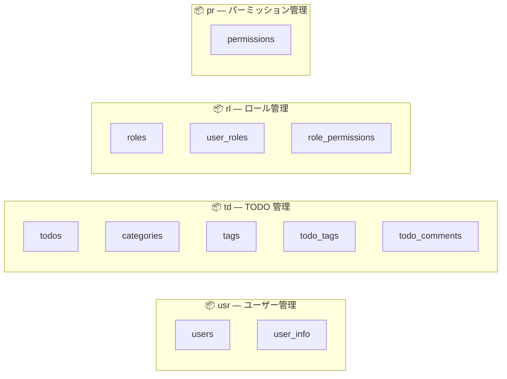
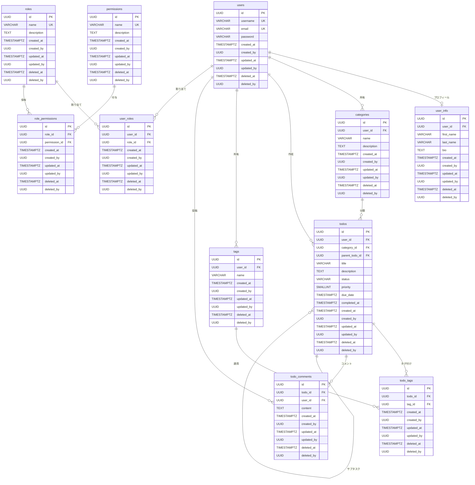
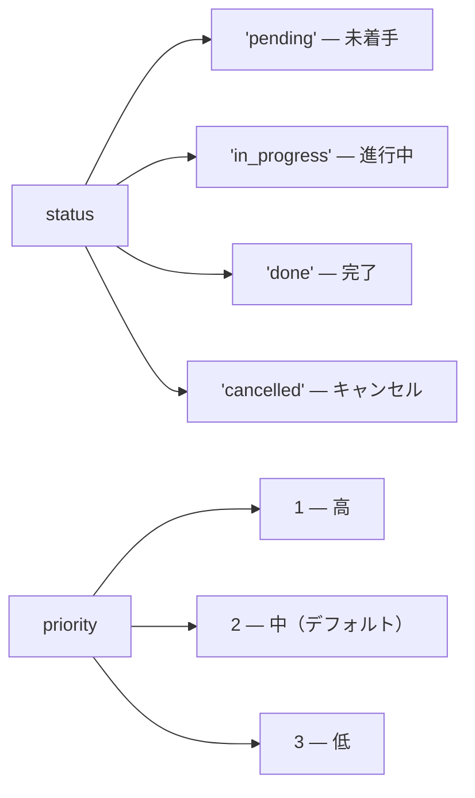
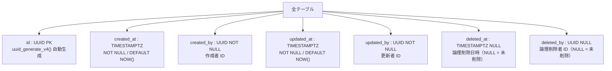

# todo-db

PostgreSQL を使用した TODO アプリケーションのデータベース定義（DDL）リポジトリです。

## 技術スタック

| 項目 | 内容 |
|---|---|
| RDBMS | PostgreSQL |
| エンコーディング | UTF-8（`LC_COLLATE = 'ja_JP.UTF-8'`, `LC_CTYPE = 'ja_JP.UTF-8'`）|
| タイムゾーン | `Asia/Tokyo` |
| UUID 生成 | `uuid-ossp` 拡張 |

## データベース

| データベース名 | 用途 |
|---|---|
| `todo_db` | 開発環境 |
| `todo_db_test` | テスト環境 |

---

## スキーマ構成



---

## ER 図



---

## テーブル一覧

### `usr` スキーマ — ユーザー管理

| テーブル | 説明 | 主なカラム |
|---|---|---|
| `usr.users` | ユーザーアカウント | `username`, `email`, `password` |
| `usr.user_info` | ユーザープロフィール | `first_name`, `last_name`, `bio` |

### `td` スキーマ — TODO 管理

| テーブル | 説明 | 主なカラム |
|---|---|---|
| `td.todos` | TODO タスク | `title`, `description`, `status`, `priority`, `due_date`, `completed_at` |
| `td.categories` | カテゴリ（ユーザーごと）| `name`, `description` |
| `td.tags` | タグ（ユーザーごと）| `name` |
| `td.todo_tags` | TODO ↔ タグ（多対多）| `todo_id`, `tag_id` |
| `td.todo_comments` | TODO コメント | `content`, `todo_id`, `user_id` |

**`td.todos` の制約値**



### `rl` スキーマ — ロール管理

| テーブル | 説明 | 主なカラム |
|---|---|---|
| `rl.roles` | ロール定義 | `name`, `description` |
| `rl.user_roles` | ユーザー ↔ ロール（多対多）| `user_id`, `role_id` |
| `rl.role_permissions` | ロール ↔ パーミッション（多対多）| `role_id`, `permission_id` |

### `pr` スキーマ — パーミッション管理

| テーブル | 説明 | 主なカラム |
|---|---|---|
| `pr.permissions` | パーミッション定義 | `name`, `description` |

---

## 共通設計

### 監査カラム（全テーブル共通）



### インデックス設計

全テーブルのインデックスに `WHERE deleted_at IS NULL` 条件（部分インデックス）を適用し、論理削除済みレコードを除いた検索を高速化しています。

| インデックス | 対象テーブル | 概要 |
|---|---|---|
| `idx_usr_users_email_active` | `usr.users` | メールアドレス検索 |
| `idx_usr_users_username_active` | `usr.users` | ユーザー名検索 |
| `idx_usr_user_info_last_name_first_name_active` | `usr.user_info` | 氏名検索 |
| `idx_td_todos_user_id_active` | `td.todos` | ユーザー別タスク検索 |
| `idx_td_todos_status_active` | `td.todos` | ステータス別検索 |
| `idx_td_todos_category_id_active` | `td.todos` | カテゴリ別検索 |
| `idx_td_todos_priority_active` | `td.todos` | 優先度別検索 |
| `idx_td_todos_due_date_active` | `td.todos` | 期限日検索 |
| `idx_td_todos_parent_todo_id_active` | `td.todos` | サブタスク検索 |
| `idx_td_categories_user_id_active` | `td.categories` | ユーザー別カテゴリ検索 |
| `idx_td_tags_user_id_active` | `td.tags` | ユーザー別タグ検索 |
| `idx_td_todo_tags_todo_id_active` | `td.todo_tags` | TODO 別タグ検索 |
| `idx_td_todo_tags_tag_id_active` | `td.todo_tags` | タグ別 TODO 検索 |
| `idx_td_todo_comments_todo_id_active` | `td.todo_comments` | TODO 別コメント検索 |
| `idx_td_todo_comments_user_id_active` | `td.todo_comments` | ユーザー別コメント検索 |
| `uniq_rl_user_roles_user_id_role_id_active` | `rl.user_roles` | ユーザー × ロール重複防止（UNIQUE） |
| `idx_rl_user_roles_user_id_active` | `rl.user_roles` | ユーザー別ロール検索 |
| `idx_rl_user_roles_role_id_active` | `rl.user_roles` | ロール別ユーザー検索 |
| `uniq_rl_role_permissions_role_id_permission_id_active` | `rl.role_permissions` | ロール × パーミッション重複防止（UNIQUE） |
| `idx_rl_role_permissions_role_id_active` | `rl.role_permissions` | ロール別パーミッション検索 |
| `idx_rl_role_permissions_permission_id_active` | `rl.role_permissions` | パーミッション別ロール検索 |
| `idx_pr_permissions_name_active` | `pr.permissions` | パーミッション名検索 |

---

## ディレクトリ構造

```
src/DDL/
├── database/       # データベース作成 SQL（dev / test）
├── extentions/     # PostgreSQL 拡張の有効化（uuid-ossp）
├── schemas/        # スキーマ作成 SQL
├── tables/         # テーブル定義（スキーマ名ごとのサブディレクトリ）
│   ├── usr/        # usr.users, usr.user_info
│   ├── td/         # td.todos, td.categories, td.tags, td.todo_tags, td.todo_comments
│   ├── rl/         # rl.roles, rl.user_roles, rl.role_permissions
│   └── pr/         # pr.permissions
└── index/          # インデックス定義（スキーマ名ごとのサブディレクトリ）
    ├── usr/
    ├── td/
    ├── rl/
    └── pr/
```